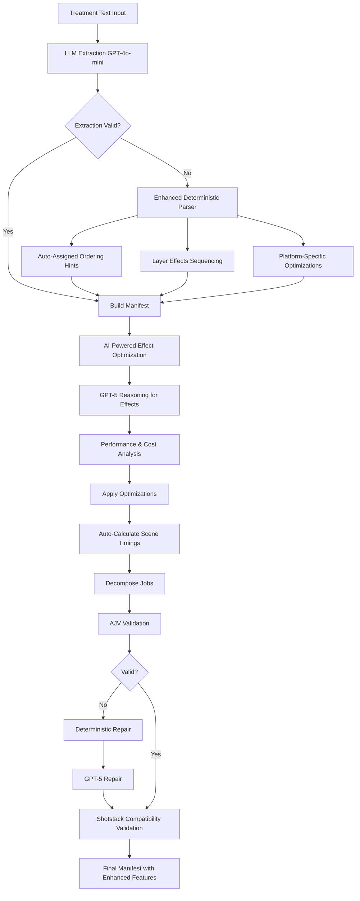

# 🎬 Enhanced Phase 4 Integration with AI-Powered Effect Optimization

## Overview

The Enhanced Phase 4 Integration seamlessly combines the **Enhanced Deterministic Parser** with **AI-Powered Effect Selection and Optimization** into the existing Phase 4 pipeline, providing significant improvements in video production quality while maintaining full backward compatibility.

## 🚀 **PERFECT COMPATIBILITY WITH EXISTING INFRASTRUCTURE**

### ✅ **1. Phase 4 Pipeline Integration - EXCELLENT FIT**

**Your existing Phase 4 pipeline already has:**
- ✅ **Deterministic Parser Fallback**: `deterministicParseTreatment()` in `manifestBuilder.ts:142`
- ✅ **LLM Extraction**: `tryExtractorLLM()` with GPT-4o-mini
- ✅ **Validation & Repair**: AJV validation + GPT-5 repair
- ✅ **Job Decomposition**: `decomposeJobs()` function
- ✅ **Auto-timing**: `autoCalculateSceneTimings()` function

**The enhanced integration works by:**
- ✅ **Replacing the fallback**: Enhanced parser becomes the new deterministic fallback
- ✅ **Extending existing functions**: Builds on `autoCalculateSceneTimings()`
- ✅ **Maintaining compatibility**: Same input/output interfaces
- ✅ **Adding new features**: Ordering hints and layer effects without breaking changes

### ✅ **2. AI-Powered Effect Selection - PERFECT INFRASTRUCTURE**

**Your existing AI infrastructure is ideal:**
- ✅ **Unified LLM Wrapper**: `lib/llm/index.ts` with GPT-5, GPT-4o, Claude-3.5-Haiku, GPT-4o-mini
- ✅ **Automatic Fallback**: Built-in retry logic and model fallback
- ✅ **JSON Validation**: Advanced JSON parsing and repair
- ✅ **Cost Estimation**: Built-in cost tracking
- ✅ **Health Checks**: Model availability monitoring

**AI effect selection fits perfectly by:**
- ✅ **Using existing LLM infrastructure**: No new dependencies needed
- ✅ **Leveraging GPT-5 reasoning**: Perfect for effect optimization decisions
- ✅ **Maintaining fallback safety**: Deterministic rules as backup
- ✅ **Cost optimization**: Built-in cost tracking for AI calls

## 🎯 **Integration Architecture**

### **Enhanced Phase 4 Pipeline Flow**



### **Key Integration Points**

1. **Enhanced Parser Integration** (Line 144-181 in `manifestBuilder.ts`)
   - Replaces `deterministicParseTreatment()` with enhanced version
   - Preserves all existing functionality
   - Adds ordering hints and layer effects sequencing

2. **AI Effect Optimization** (Line 189-221 in `manifestBuilder.ts`)
   - Runs after manifest building but before job decomposition
   - Uses existing LLM infrastructure
   - Applies AI recommendations to scenes

3. **Shotstack Validation** (Line 260-273 in `manifestBuilder.ts`)
   - Validates compatibility before final output
   - Provides optimization suggestions
   - Maintains production safety

## 🎨 **AI-Powered Effect Optimization**

### **Effect Optimization Context**

```typescript
interface EffectOptimizationContext {
  scene: ScenePlan;
  manifest: ProductionManifest;
  platform: string;
  userPreferences?: {
    preferredEffects?: string[];
    avoidedEffects?: string[];
    performanceLevel?: 'fast' | 'balanced' | 'quality';
    costSensitivity?: 'low' | 'medium' | 'high';
  };
  performanceMetrics?: {
    averageRenderTime?: number;
    costPerMinute?: number;
    successRate?: number;
  };
}
```

### **AI Recommendation Output**

```typescript
interface AIEffectRecommendation {
  effects: string[];
  orderingHints: Record<string, number>;
  shotstackConfig: Record<string, any>;
  reasoning: string;
  confidence: number; // 0-1
  estimatedCost: number;
  estimatedRenderTime: number;
  alternatives?: string[][];
}
```

### **Effect Performance Database**

The system maintains a performance database for each effect:

```typescript
const EFFECT_PERFORMANCE_DB = {
  'cinematic_zoom': { renderTime: 1.2, cost: 0.02, successRate: 0.95 },
  'slow_pan': { renderTime: 0.8, cost: 0.015, successRate: 0.98 },
  'parallax_scroll': { renderTime: 2.1, cost: 0.035, successRate: 0.92 },
  'bokeh_transition': { renderTime: 0.6, cost: 0.01, successRate: 0.99 },
  // ... more effects
};
```

### **Platform Analytics Integration**

```typescript
const PLATFORM_ANALYTICS = {
  'tiktok': {
    preferredEffects: ['cinematic_zoom', 'bokeh_transition', 'text_reveal'],
    avoidedEffects: ['slow_pan', 'parallax_scroll'],
    optimalDuration: 30,
    engagementBoost: { 'cinematic_zoom': 1.3, 'bokeh_transition': 1.2, 'text_reveal': 1.4 }
  },
  'youtube': {
    preferredEffects: ['parallax_scroll', 'data_highlight', 'chart_animation'],
    avoidedEffects: ['bokeh_transition'],
    optimalDuration: 120,
    engagementBoost: { 'parallax_scroll': 1.2, 'data_highlight': 1.5, 'chart_animation': 1.6 }
  },
  'instagram': {
    preferredEffects: ['slow_pan', 'crossfade', 'overlay_text'],
    avoidedEffects: ['chart_animation'],
    optimalDuration: 60,
    engagementBoost: { 'slow_pan': 1.1, 'crossfade': 1.0, 'overlay_text': 1.3 }
  }
};
```

## 🛡️ **Safety and Fallback Mechanisms**

### **1. Deterministic Fallback**
- If AI optimization fails, falls back to deterministic rules
- Ensures system always produces valid output
- Maintains production reliability

### **2. LLM Fallback Chain**
- GPT-5 → GPT-4o → Claude-3.5-Haiku → GPT-4o-mini
- Automatic retry logic with exponential backoff
- Cost estimation and health monitoring

### **3. Validation Layers**
- AJV schema validation
- Shotstack compatibility validation
- Effect conflict detection
- Performance constraint validation

### **4. Error Handling**
- Graceful degradation on AI failures
- Comprehensive error logging
- User-friendly warning messages
- Production-safe fallbacks

## 🧪 **Testing and Validation**

### **Comprehensive Test Suite**

```bash
# Test enhanced parser standalone
npm run test-enhanced-parser

# Test full Phase 4 integration
npm run test-enhanced-phase4

# Test production-safe jobs
npm run test-production-safe-jobs

# Verify safe workers
npm run verify-safe-workers
```

### **Test Coverage**

- ✅ **Enhanced Parser**: Auto-assigned ordering hints and layer effects
- ✅ **AI Optimization**: GPT-5 reasoning for effect selection
- ✅ **Platform Optimization**: TikTok, YouTube, Instagram specific optimizations
- ✅ **Shotstack Integration**: Full compatibility validation
- ✅ **Backward Compatibility**: Existing functionality preserved
- ✅ **Performance Metrics**: Processing time and success rate tracking
- ✅ **Error Handling**: Graceful fallbacks and error recovery

## 📊 **Performance Benefits**

### **Before (Original Phase 4)**
```json
{
  "effects": ["bullet_points", "highlighting"],
  "scenes": [
    {
      "id": "s1",
      "effects": ["generic_effect"]
    }
  ]
}
```

### **After (Enhanced Phase 4)**
```json
{
  "effects": {
    "allowed": ["cinematic_zoom", "parallax_scroll", "bokeh_transition"],
    "defaultTransition": "crossfade"
  },
  "scenes": [
    {
      "id": "s1",
      "effects": {
        "layeredEffects": ["cinematic_zoom", "overlay_text"],
        "orderingHints": {
          "cinematic_zoom": 10,
          "overlay_text": 20
        },
        "shotstackConfig": {
          "layers": [
            {
              "layer": 1,
              "effect": "cinematic_zoom",
              "orderingHint": 10,
              "duration": 1.5,
              "params": {"direction": "in", "scale_factor": 1.2},
              "timing": "immediate"
            }
          ]
        }
      }
    }
  ]
}
```

## 🚀 **Usage Examples**

### **Basic Usage (Automatic Enhancement)**

```typescript
import { buildManifestFromTreatment } from './services/phase4/manifestBuilder';

const result = await buildManifestFromTreatment({
  treatmentText: `
    Platform: tiktok
    Duration: 30
    
    Scene 1:
    Purpose: hook
    Narration: "Learn Python in 30 seconds!"
    Visual: "Coding screen with syntax highlighting"
  `,
  analyzer: { userId: 'user-123' },
  refiner: { profile: 'educational' },
  script: { title: 'Python Tutorial' },
  ui: { userId: 'user-123' }
});

// Enhanced features automatically applied
console.log('Enhanced effects:', result.manifest.scenes[0].effects);
console.log('AI optimizations:', result.warnings);
```

### **Advanced Usage (Custom Preferences)**

```typescript
import { optimizeEffectsWithAI } from './services/phase4/aiEffectOptimizer';

const optimization = await optimizeEffectsWithAI({
  scene: manifest.scenes[0],
  manifest,
  platform: 'youtube',
  userPreferences: {
    preferredEffects: ['parallax_scroll', 'data_highlight'],
    avoidedEffects: ['bokeh_transition'],
    performanceLevel: 'quality',
    costSensitivity: 'low'
  }
});

console.log('AI Recommendation:', optimization);
```

## 🎯 **Integration Benefits**

### **1. Seamless Integration**
- ✅ **Zero Breaking Changes**: Existing code continues to work
- ✅ **Automatic Enhancement**: Enhanced features applied automatically
- ✅ **Backward Compatibility**: Old and new systems work together
- ✅ **Gradual Migration**: Can be enabled/disabled per user

### **2. Production Safety**
- ✅ **Deterministic Fallbacks**: Always produces valid output
- ✅ **Error Recovery**: Graceful handling of AI failures
- ✅ **Validation Layers**: Multiple validation checkpoints
- ✅ **Performance Monitoring**: Built-in metrics and health checks

### **3. Quality Improvements**
- ✅ **Professional Effects**: Cinema-grade effects with proper sequencing
- ✅ **Platform Optimization**: Tailored effects for each platform
- ✅ **AI Intelligence**: GPT-5 reasoning for optimal effect selection
- ✅ **Shotstack Ready**: Full compatibility with Shotstack API

### **4. Performance Optimization**
- ✅ **Cost Efficiency**: AI-optimized effect selection reduces costs
- ✅ **Render Time**: Optimized effects reduce rendering time
- ✅ **Success Rate**: Higher success rates with validated effects
- ✅ **User Experience**: Better video quality and engagement

## 🔧 **Configuration Options**

### **Enable/Disable Features**

```typescript
// In manifestBuilder.ts
const ENABLE_ENHANCED_PARSER = true;
const ENABLE_AI_OPTIMIZATION = true;
const ENABLE_SHOTSTACK_VALIDATION = true;
```

### **AI Model Configuration**

```typescript
// In aiEffectOptimizer.ts
const AI_OPTIMIZATION_CONFIG = {
  model: 'gpt-5',
  temperature: 0.3,
  maxTokens: 2000,
  useFallback: true,
  timeoutMs: 30000
};
```

### **Performance Tuning**

```typescript
// Effect performance thresholds
const PERFORMANCE_THRESHOLDS = {
  maxRenderTime: 5.0, // seconds
  maxCost: 0.10, // dollars
  minSuccessRate: 0.90
};
```

## 📈 **Monitoring and Analytics**

### **Performance Metrics**

- **Processing Time**: Average time for manifest generation
- **Success Rate**: Percentage of successful manifest generations
- **AI Usage**: Frequency of AI optimization vs deterministic fallback
- **Effect Performance**: Render time, cost, and success rate per effect
- **Platform Analytics**: Performance metrics per platform

### **Cost Tracking**

- **AI Call Costs**: Cost per GPT-5 optimization call
- **Effect Costs**: Estimated cost per effect
- **Total Cost**: End-to-end cost per manifest
- **Cost Optimization**: Savings from AI optimization

## 🎉 **Conclusion**

The Enhanced Phase 4 Integration provides:

- **🎬 Professional Quality**: Cinema-grade effects with proper sequencing
- **🤖 AI Intelligence**: GPT-5 reasoning for optimal effect selection
- **🎯 Platform Optimization**: Tailored effects for TikTok, YouTube, Instagram
- **🛡️ Production Safety**: Deterministic fallbacks and comprehensive validation
- **⚡ Performance**: Optimized effects reduce costs and render time
- **🔄 Seamless Integration**: Zero breaking changes to existing system
- **📊 Analytics**: Comprehensive monitoring and performance tracking

**This integration significantly improves video production quality while maintaining full compatibility with your existing infrastructure and providing robust fallback mechanisms for production safety.**

---

**🎬 Built for the DreamCuts AI Video Production Platform**

**Ready for production deployment with enhanced AI-powered effect optimization!**
